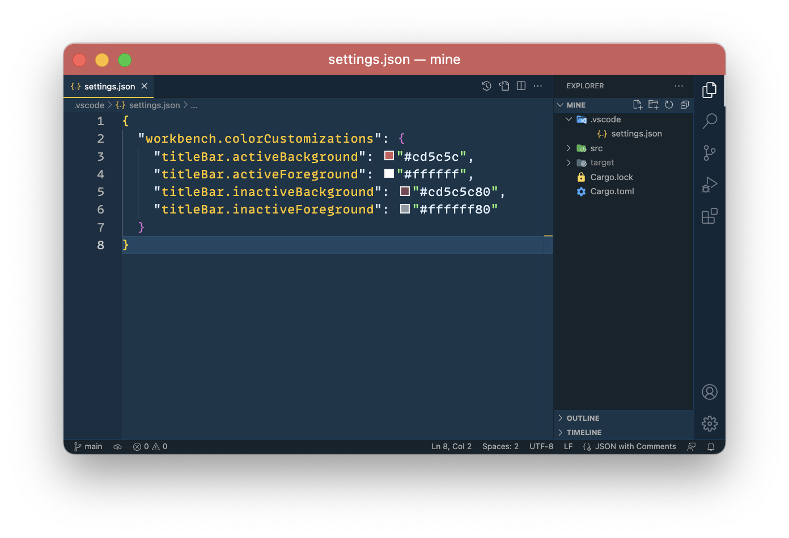
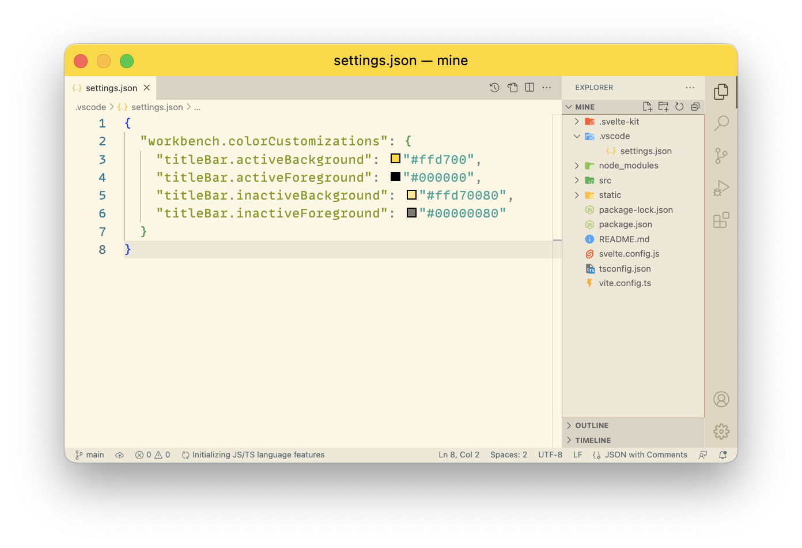
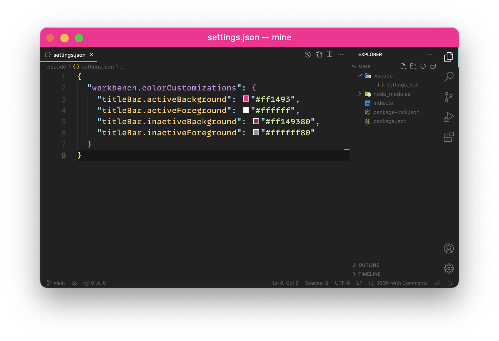

# Mine

`mine` is a nifty CLI app that adds a splash of color to your workspace. By choosing a hue from the vast array of CSS named colors, mine allows you to tell your projects apart with just a glance.

## Why?

Juggling multiple repositories locally was challenging until [this tip](https://twitter.com/wesbos/status/998993638578376709?s=20) from Wes Bos of [the Syntax podcast](https://syntax.fm) came to the rescue. Now, `mine` handles the once-tedious task of creating VS Code settings for each cloned repo.
Thank you!

## Features

- Locates project root and updates settings automatically
- Selects random hues from CSS named colors
- Enhances visual project distinction
- Supports Visual Studio Code, with more editors soon

## Screenshots

### Indian Red with [Cobalt2](https://marketplace.visualstudio.com/items?itemName=wesbos.theme-cobalt2) theme



### Gold with Solarized Light theme



### Deep Pink with [Material Theme Darker](https://marketplace.visualstudio.com/items?itemName=Equinusocio.vsc-material-theme) theme



## Installation

### Homebrew

Preferred installation for MacOS and Linux via [Homebrew](https://brew.sh/):

```bash
brew install joelzanden/tap/mine
```

### Precompiled binaries

You can download precompiled binaries for Windows, Linux and MacOS from the [releases page](https://github.com/joelzanden/mine/releases).

### Build from Source

With Rust and Cargo installed, build `mine` from source:

```bash
cargo build --release
```

## Usage

Install `mine`, add to your system's PATH, then run in your project directory:

```bash
mine
```

This command finds the project root, updates the settings file with a random CSS named color, and applies it to the editor's top portion.

<details>
<summary>Supported Project Files and Folders</summary>

This utility detects and locates project hierarchy roots by searching for specific project files and folders. The table below outlines the currently supported files and folders, organized by programming language or framework.

| Language / Framework | File(s)                                                                                                                                                 |
| :------------------- | :------------------------------------------------------------------------------------------------------------------------------------------------------ |
| General              | .dockerignore, .editorconfig, .git, .github, .gitignore, .gitlab-ci.yml, .travis.yml, Dockerfile, Jenkinsfile, LICENSE, README.md, Vagrantfile, .vscode |
| Angular              | angular.json                                                                                                                                            |
| ASP.NET              | project.json                                                                                                                                            |
| C#                   | .csproj, .fsproj, .sln, project.json                                                                                                                    |
| C++                  | CMakeLists.txt, Makefile                                                                                                                                |
| Clojure              | project.clj                                                                                                                                             |
| Crystal              | shard.yml                                                                                                                                               |
| Dart                 | pubspec.yaml                                                                                                                                            |
| Elixir               | mix.exs                                                                                                                                                 |
| Elm                  | elm.json                                                                                                                                                |
| Ember                | ember-cli-build.js                                                                                                                                      |
| Erlang               | rebar.config                                                                                                                                            |
| F#                   | paket.dependencies                                                                                                                                      |
| Go                   | go.mod                                                                                                                                                  |
| Groovy               | build.gradle                                                                                                                                            |
| Haskell              | stack.yaml                                                                                                                                              |
| Java                 | build.gradle, pom.xml                                                                                                                                   |
| Julia                | Project.toml                                                                                                                                            |
| Lua                  | lua                                                                                                                                                     |
| Meteor               | meteor                                                                                                                                                  |
| Nim                  | nim.cfg                                                                                                                                                 |
| Node                 | lerna.json, package.json, yarn.lock                                                                                                                     |
| OCaml                | dune                                                                                                                                                    |
| Perl                 | cpanfile                                                                                                                                                |
| PHP                  | composer.json                                                                                                                                           |
| PowerShell           | psakefile.ps1                                                                                                                                           |
| Python               | Pipfile, pyproject.toml, requirements.txt, setup.py                                                                                                     |
| R                    | DESCRIPTION                                                                                                                                             |
| Ruby                 | .gemspec, Gemfile, Rakefile                                                                                                                             |
| Rust                 | Cargo.toml                                                                                                                                              |
| Scala                | build.sbt                                                                                                                                               |
| Svelte               | svelte.config.js                                                                                                                                        |
| Swift                | Package.swift                                                                                                                                           |
| TypeScript           | tsconfig.json                                                                                                                                           |
| Vue                  | vue.config.js                                                                                                                                           |

</details>

## Contributing

If you're interested in contributing to Mine, please feel free to open an issue or submit a pull request on the GitHub repository.
